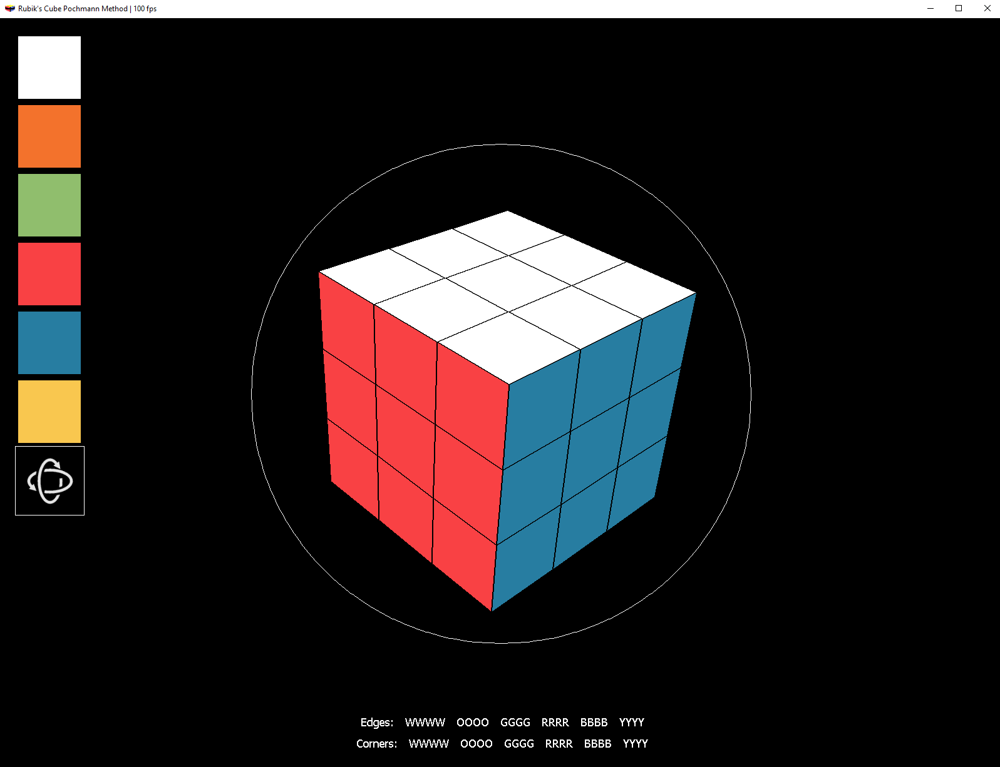
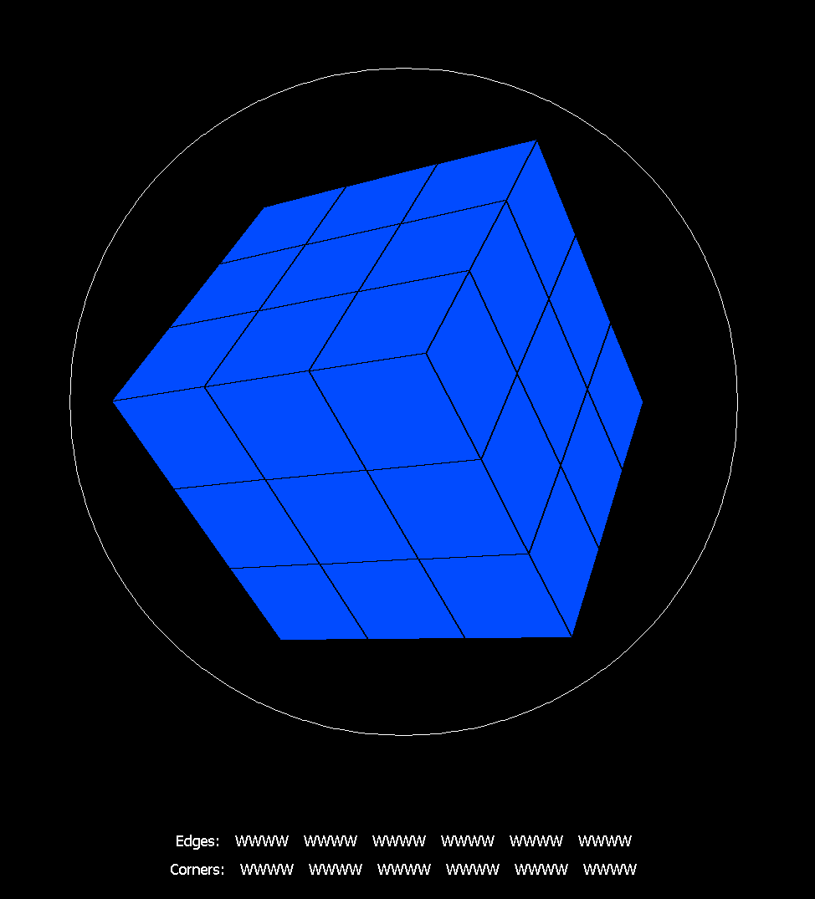
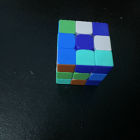
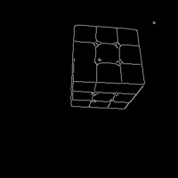

# Blind_Rubiks_Cube_Solver

The purpose of this project is to create an interactive 3D solver of the Rubik's Cube to create Pochmann Method solutions for Blind Rubik's Cube solving.

This project encompasses my first 3D Graphics Engine from scratch as well as a custom solver for the Rubik's Cube.

## Design

### Overview

A white sphere surrounds the cube showing the user the bounds for the cursor when rotating the cube by dragging.
The bottom middle contains a quick summary of which color faces have been colored, denoted by the first letter of the color.
*(W = White, O = Orange, G = Green, R = Red, B = Blue, Y = Yellow)*

### Action Bar
The rendering speed is customizable and can be set to any positive value. Measured in frames per second, it is displayed in the action bar along side the favicon.

### Orbiting
The Rubik's Cube can further be explored in free-view by selecting the orbit button, any selecting a button is visualized by a white bounding square.

### Hidden Mode

## Controls

### 1. Left Click
#### Painting
The user may paint the Rubik's cube by first *left clicking* on the panel of colors on the left, then *left clicking* on the desired face.
#### Rotating
The user may manipulate the cube by first selecting the "Orbit" button by *left clicking*, then *left clikcing and dragging* across the surface of the cube in their desired direction.
### 2. Middle Click
#### Hidden Mode
By pressing the *middle mouse button* the cube will enable the 'Hidden Mode'. This mode clears all colors and phases through different color, giving the user something to focus on to solve the cube 'blindly' without a physical blindfold.
The Hidden Mode can be enabled or disabled by pressing the *middle mouse button* again.

## In The Works
Currently I am finishing the Pochmann algorithm. I plan to continue work on a Computer Vision implementation to allow the sides of the cube to be scanned in for increased ease of use.

Sample Cube:

Edge Map from Canny Algorithm:

Hough Transform:

